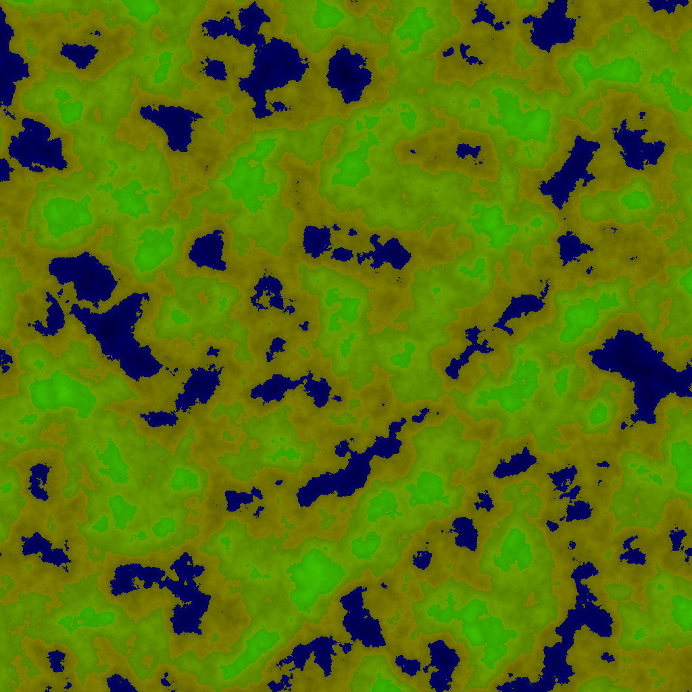

# Perlin Simplex Noise Rust Implementation (1D, 2D, 3D)

## Showcase
| <a href="./examples/noise.rs">Simplex Noise 2D</a> | <a href="./examples/noise.rs">Simplex Noise 2D with fBm</a> | <a href="./examples/noise.rs">Simple Terrain Synthesis</a>    |
|----------------------------------------------------|---------------------------------------------------------------------------------|---------------------------------------------------------------|
|       |                    |  |

## Algorithms
### Simplex Noise
It is a coherent noise function by Perlin which is the improvement to his Perlin Noise. The 3D version of it was [patented](https://patents.google.com/patent/US6867776) and expired in 2022. The main idea is to have an n dimensional space is subdivided into simplices, which are made approximately uniform by means of a skew factor, with which interpolation is carried out. A hashed gradient is usually used for interpolation, which is implemented by a permutation table and a gradient table.

### Fractional Brownian motion (fBm)
The summation of successive octaves of the noise is suitable for terrain synthesis, procedural clouds or other things.

* Frequency - Width of pattern
* Amplitude - Height of pattern
* Lacunarity - Change of frequency in succesives octaves
* Gain - Change of amplitude in succesives octaves

### RNG (Linear congruential generator)
The simplex noise makes use of a permutation table, therefore I have implemented a simple linear congruential generator by using the formula, where N0 is the hash of the seed.
```
N+1 = (134775813 * (N + 1)) mod (2^32 -1)
```

## About
This implementation is based on the [C++ implementation](https://github.com/SRombauts/SimplexNoise) by Sebastien Rombauts. This implementation does not guarantee a correct or complete implementation of the simplex noise algorithm nor is it a goal of this project. The aim is to create an efficient implementation of a noise algorithm that can be used in conjunction with other algorithms for practical purposes.

### Features
* 1D, 2D and 3D implementation of Simplex Noise.
* Fractional Brownian Motion (fBm) with noise summation.
* Seedable permutation table
* Gradient lookup table
### Wishlist
* Implement 4D and a generic algorithm for any dim
* Optimization

## License
The source code is copyrighted by: Dan Häßler and Sebastien Rombauts and it is distributed under the terms of the MIT license.

Please see LICENSE file for details or copy at http://opensource.org/licenses/MIT.
